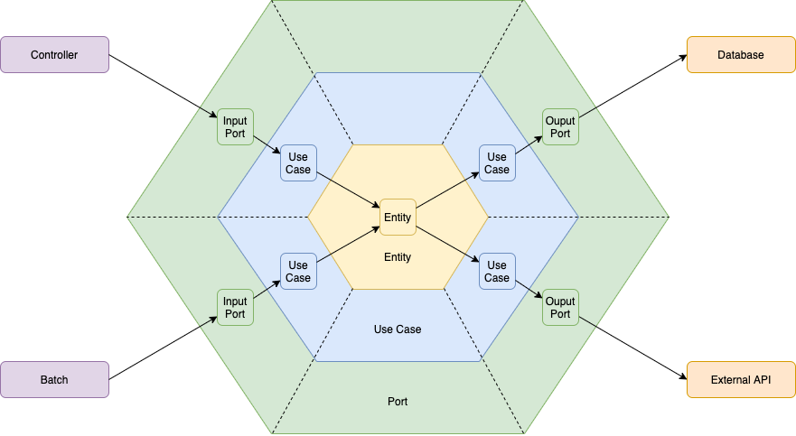

# Introduction
Utility classes to support applications developed in a hexagonal architecture pattern

## Developers
The library assumes an application structure based on the architecture below.



The classes available in the library allow quick creation of entities with common use cases, such as CRUD.

## Usage
```
<dependency>
    <groupId>com.github.ryneal</groupId>
    <artifactId>hexagonal-domain</artifactId>
    <version>1.0.0</version>
</dependency>
```